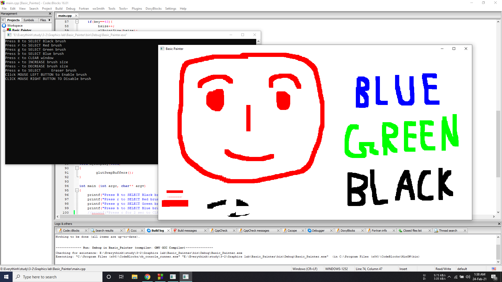

# Basic_Painter_using_GLUT
Paint using 4 color brush

It was developed as a course work for Graphics lab course (3/2)
## Instruction

Run the project using Codeblocks, then:

Press B to SELECT Black brush

Press r to SELECT Red brush

Press g to SELECT Green brush

Press b to SELECT Blue brush

Press c to CLEAR window

Press + to INCREASE brush size

Press - to DECREASE brush size

Press e to SELECT     Eraser brush

Click MOUSE LEFT BUTTON to Enable brush

CLICK MOUSE RIGHT BUTTON TO Disable brush

## Specs
GLUT (GL Utilities Toolkit) library is used to use OpenGl

**Some SS from this project:**

